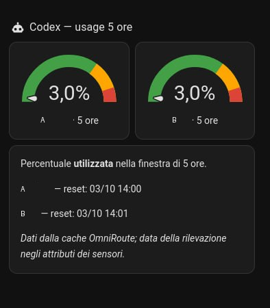

# OmniRoute for Home Assistant

Bring your OmniRoute gateway into Home Assistant: monitor availability, provider-account quotas, installed version, and **Codex usage in the 5-hour window** — all from your dashboard.

[](LICENSE)
[](https://www.home-assistant.io/)

**UI configuration · HACS custom repository · Multiple accounts · Local polling**

> This is a community-maintained custom integration, not an official Home Assistant or OmniRoute integration. It monitors your gateway; it does not install OmniRoute, run AI requests, or install gateway updates.

## What you get

| Sensor | What it shows |
| --- | --- |
| **Health** | `healthy` when the health endpoint responds successfully and the coordinator refresh succeeds. |
| **Remaining quota** | Remaining quota percentage reported by OmniRoute, separately for each connection/account. |
| **Version** | The installed OmniRoute version. |
| **Latest Version** | The latest version reported by OmniRoute, or `unknown` when unavailable. |
| **Update Available** | `yes`, `no`, or `unknown`. Informational only — no automatic updates. |
| **Codex Usage 5h** | Percentage **used** in the upstream 5-hour window, separately for each Codex account. |

Account quota sensors include provider, account name, used/total quota, reset time, and token status when available. Codex sensors include `reset_at`, `fetched_at`, and `window_seconds`.

Accounts are identified by their connection ID, so multiple accounts from the same provider remain separate. New accounts are discovered during polling. Polling runs every **60 seconds**.

## Requirements

- A running Home Assistant installation with access to its configuration directory if installing manually.
- A running OmniRoute instance reachable **from Home Assistant**, not just from your browser.
- An OmniRoute API key permitted to read the usage endpoints. A key that works for inference may still return **403** for usage monitoring.
- [HACS](https://www.hacs.xyz/docs/use/download/download/) for the HACS installation method; manual installation does not require HACS.

The integration has been exercised against OmniRoute **3.8.51**. Endpoint availability and response formats may differ in other versions. A minimum Home Assistant version has not yet been established by a compatibility matrix; use an up-to-date Home Assistant Core.

## Install with HACS

> **Current distribution note:** the published `v0.1.0` release predates the latest fixes and monitoring sensors. Use the current `main` revision, where HACS allows selecting it, or the manual installation below. Installing the old release will not provide all features documented here.

1. Open **HACS** in Home Assistant.
2. Open its menu and select **Custom repositories**.
3. Enter this repository URL:
   ```text
   https://github.com/paraflu/ha-omniroute
   ```
4. Select **Integration** as the category/type and add the repository.
5. Search for **OmniRoute**, open it, and download it. Select the current `main` revision if available in the download/version selector.
6. **Restart Home Assistant Core** so it loads the custom integration.
7. Continue with [Configure the integration](#configure-the-integration).

Menu labels can vary between HACS versions. If your HACS version only offers the old release, use the manual method rather than assuming it contains the current code.

## Install manually

1. Download the [current source ZIP](https://github.com/paraflu/ha-omniroute/archive/refs/heads/main.zip) and extract it.
2. Copy the `custom_components/omniroute` directory into your Home Assistant configuration directory, creating `custom_components` if needed.
3. Confirm this layout:
   ```text
   <configuration directory>/
   └── custom_components/
       └── omniroute/
           ├── __init__.py
           ├── config_flow.py
           ├── const.py
           ├── coordinator.py
           ├── manifest.json
           ├── monitoring.py
           ├── sensor.py
           └── translations/
               └── en.json
   ```
   On Home Assistant OS, the configuration directory is normally `/config`. On Container/Core installations, use your actual configuration directory or mounted configuration volume. Copy the **integration directory**, not the entire repository into it.
4. **Restart Home Assistant Core**.
5. Continue with the configuration steps below.

## Configure the integration

1. Go to **Settings → Devices & services → Add integration**.
2. Search for **OmniRoute**.
3. Enter:
   - **URL:** your OmniRoute base URL, including `http://` or `https://` and the port when needed.
   - **API key:** your authorized OmniRoute API key.
4. Submit the form and allow the first refresh to complete.
5. Find the new entities under the integration or in **Settings → Devices & services → Entities**.

Example URL — replace it with your own gateway address:

```text
http://192.168.1.50:20128
```

Use the **base URL**, not `/v1`, `/api/health`, or another API endpoint. Do not embed a username/password, query string, or fragment in the URL. When Home Assistant runs in a container, `localhost` points to that container, not to a separate OmniRoute host.

The form validates the URL format; connection and authorization are checked during integration setup. Successfully submitting the form does not by itself prove the gateway is reachable.

### Change the URL or API key

Open the OmniRoute entry under **Settings → Devices & services** and choose **Configure** (Options). Enter the URL and key again, then save. The entry reloads with the new settings; you do not need to delete it.

## Dashboard preview



Real Home Assistant example, with personal names replaced by **A** and **B**. The screenshot uses Italian labels; the ready-to-use card below uses English labels.

### Two-account Codex gauge card

Download or copy [`examples/codex-usage-card.yaml`](examples/codex-usage-card.yaml). It uses native Home Assistant cards and displays two usage gauges, local reset times, and the timestamp of each upstream reading.

1. Open your dashboard and select **Edit dashboard → Add card → Manual**.
2. Paste the contents of the example YAML file.
3. Replace **every occurrence** of `sensor.your_codex_account_a_usage_5h` and `sensor.your_codex_account_b_usage_5h` with your actual entity IDs, including those in the Markdown template.
4. Change the account labels if desired and save.

The gauge colors indicate used allowance: green below 70%, yellow from 70%, red from 90%. They are display thresholds, not provider-imposed limits.

## Add a dashboard card

Edit your dashboard, add a **Manual** card, and use an Entities card like this:

```yaml
type: entities
title: OmniRoute
show_header_toggle: false
entities:
  - entity: sensor.omniroute_health
    name: Gateway health
  - entity: sensor.omniroute_version
    name: Installed version
  - entity: sensor.omniroute_latest_version
    name: Latest version
  - entity: sensor.omniroute_update_available
    name: Update available
  - entity: sensor.replace_with_your_codex_usage_5h_entity
    name: Codex usage — 5 hours
```

**Replace entity IDs with the ones created in your installation.** The health ID and account-specific IDs can vary because of existing entities, account names, or multiple gateways. Copy them from the entity settings; the Codex entry above is deliberately a placeholder.

## Understanding the readings

### Codex: used, not remaining

A Codex Usage 5h value of **3%** means 3% of the reported 5-hour allowance has been used. This is an upstream quota percentage, **not** a token count, monetary cost, or a local sum of requests made in the last five hours.

The integration selects the quota window whose duration is exactly 18,000 seconds. It does not substitute the weekly quota when the 5-hour window is missing.

OmniRoute serves these readings from its provider-limit cache. Refreshing Home Assistant does **not** force a fresh upstream quota fetch. Check `fetched_at` to see how recent the underlying reading is; `reset_at` is the reset time supplied by OmniRoute. These timestamps are typically UTC.

### Unknown is not zero

- An unknown quota is shown as `unknown`, not as zero usage or zero remaining credit.
- If OmniRoute cannot determine the latest version, both latest version and update availability remain `unknown` — not “up to date”.
- A reported 100% remaining with no known quota total is **not independent confirmation of available upstream credit**.
- If the main health/quota refresh fails, coordinator-backed entities become unavailable. Optional version/provider-limit endpoint failures do not disable the existing health/quota sensors.

## API endpoints

All requests are sent to your configured OmniRoute instance. Usage requests use the API key as a Bearer token.

| Endpoint | Purpose |
| --- | --- |
| `/api/health` | Gateway HTTP availability. |
| `/api/usage/quota` | Account discovery and remaining quota readings. |
| `/api/system/version` | Installed/latest version and update flag. |
| `/api/usage/provider-limits` | Cached upstream windows, including Codex 5-hour usage. |

This integration does not query GitHub directly for release information. Latest-version detection depends on what OmniRoute returns.

## Troubleshooting

| Symptom | What to check |
| --- | --- |
| OmniRoute does not appear in Add integration | Confirm the directory layout, restart Core after installation, and inspect the Home Assistant logs. |
| Setup fails or entities become unavailable | Check the base URL, connectivity from Home Assistant, gateway availability, and Core logs. |
| HTTP 401 or 403 | Check key validity and permissions for usage monitoring. A working `/v1/models` request does not prove usage access. |
| Version/update sensors are `unknown` | Check whether your OmniRoute version exposes `/api/system/version` and whether it can determine the latest release. |
| No Codex 5-hour sensor | Confirm a Codex account appears in the quota response and a matching 5-hour window exists in the provider-limit cache. |
| Codex usage looks unchanged | Inspect `fetched_at`. Home Assistant may be polling successfully while OmniRoute's upstream cache is unchanged. |
| New features are missing after installation | Check the installed source revision; the old `v0.1.0` release does not contain the current monitoring features. |

Look under **Settings → System → Logs** for `custom_components.omniroute`. Home Assistant's standard warning about an untested custom integration is expected; a traceback or failed setup is not.

## Updating or removing

Before a manual update, back up your existing `custom_components/omniroute` directory. Replace it with the current integration directory and restart Core. For HACS-managed installations, use its update/redownload controls and restart when requested.

To remove the integration, delete its entry under **Settings → Devices & services**. You can then remove the downloaded integration through HACS, or delete its directory for a manual installation, and restart Core.

## Security and privacy

- Enter API keys directly in Home Assistant. Never include them in screenshots, issues, dashboard YAML, or public configuration examples.
- Protect Home Assistant backups: configuration entries contain the API key.
- Prefer HTTPS when requests cross an untrusted network; an HTTP connection does not encrypt the Bearer token.
- Account names and quota metadata may be visible in entity names/attributes. Redact them when sharing screenshots or diagnostics.
- The integration does not install updates or modify your OmniRoute accounts.

## Development and support

The GitHub Actions workflow in [`.github/workflows/tests.yml`](.github/workflows/tests.yml) runs on pushes, pull requests, and manual dispatches. It installs the pinned test baseline, runs pytest, and compiles the integration.

Reproduce the same test environment locally with Python 3.13:

```bash
python -m venv .venv
source .venv/bin/activate
python -m pip install -r requirements-test.txt
python -m pytest -q
```

Tests cover config flow, lifecycle regressions, account parsing, coordinator-backed sensors, version availability, and Codex-window parsing. Local tests do not replace a live Home Assistant installation test.

Found a problem? [Open an issue](https://github.com/paraflu/ha-omniroute/issues) with your Home Assistant/OmniRoute versions, installation method, and a **redacted** error traceback. Include cache timestamps when reporting stale usage readings.

## License

[MIT](LICENSE).
